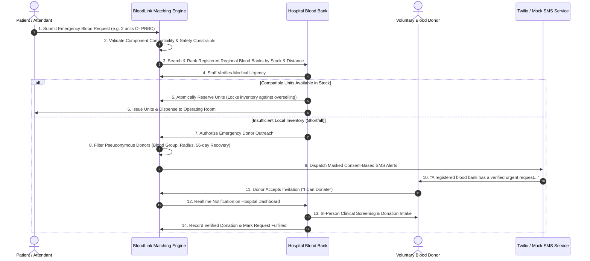

# BloodLink AI: Complete 10-Step Operational Workflow Guide

This document describes the end-to-end clinical workflow connecting patients, hospitals, blood banks, and voluntary donors during an acute transfusion emergency.

---

## Step-by-Step Breakdown

### Step 1: Emergency Patient Request Submission
A patient attendant, triage nurse, or emergency physician enters:
- Patient Name or De-identified Case ID (e.g. `Emergency Trauma Case #104`)
- Blood Group (e.g. `O-`)
- Blood Component (Packed Red Blood Cells, Platelets, Plasma, Whole Blood, Cryoprecipitate)
- Units Required (e.g. `2 units`)
- Urgency Level (`critical`, `urgent`, `routine`)
- Receiving Hospital Facility
- Required-by timestamp and clinical notes

### Step 2: Intelligent Compatibility Validation
The matching module applies clinical transfusion rules:
- Red cells check antigen-antibody reaction (O- is universal donor; AB+ is universal recipient).
- Plasma checks inverse antibody reaction (**AB is universal plasma donor**).
- Dynamic distance is computed using the Haversine formula against verified hospital coordinates.

### Step 3: Multi-Facility Inventory Ranking
The system evaluates all registered healthcare institutions within the metropolitan area and ranks them based on:
1. Available compatible stock count
2. Distance in kilometers from the receiving trauma bay
3. Verified operational status (24/7 Level 1 Trauma vs Regional Center)

### Step 4: Hospital Staff Verification
To prevent fraudulent requests and safeguard blood resources, authorized hospital personnel (`hospital_staff` or `admin` role) review the case and mark it **Verified**.

### Step 5: Atomic Inventory Reservation
When stock is available, hospital staff executes an atomic reservation.
- **Race condition prevention**: The operation is wrapped in an atomic database transaction. If two surgeons request the same O- batch simultaneously, the second transaction is safely constrained, preventing overselling.
- **Movements Audit**: A permanent movement record is stored with user ID, batch ID, previous status, and clinical reason.

### Step 6: Shortfall Detection & Outreach Authorization
If the hospital has fewer units than required (e.g. only 1 unit in stock for a 3-unit trauma requirement), the system flags an inventory shortfall and presents the **Launch Donor Outreach** button.

### Step 7: Pseudonymous Donor Candidate Screening
The matching engine queries the operational database (`donor_matching_profiles`):
- Filters candidate donors by component compatibility.
- Enforces the **56-Day Recovery Rule** (calculates elapsed days since last verified donation).
- Filters by donor service radius (e.g. within 25–35 km).
- Checks donor self-reported availability (`is_available = true`).
- Scores candidates by a composite formula (exact match + proximity + proven track record).

### Step 8: Privacy-Preserving Alert Dispatch
The server resolves candidate contact details strictly inside the internal notification daemon:
- Donor telephone numbers are **never exposed** to hospital staff or patients.
- Masked SMS messages are dispatched via Twilio (or the interactive Mock Sandbox).
- SMS body contains only the hospital facility name, blood group, and a secure case response link.

### Step 9: Donor Response & Real-Time Sync
The donor receives the alert on their phone or web portal and clicks **Accept** ("I Can Donate") or **Decline**.
- When accepted, the hospital dashboard receives an instant WebSocket event.
- The hospital operations board displays the donor's arrival window.

### Step 10: Clinical Screening & Request Fulfillment
The donor arrives at the accredited blood bank:
1. Clinical staff performs in-person hemoglobin screening and health intake.
2. Blood is drawn, tested, and cross-matched.
3. Hospital marks the emergency request as **Fulfilled**.
4. A verified record is written to `donation_records`, resetting the donor's 56-day timer.
